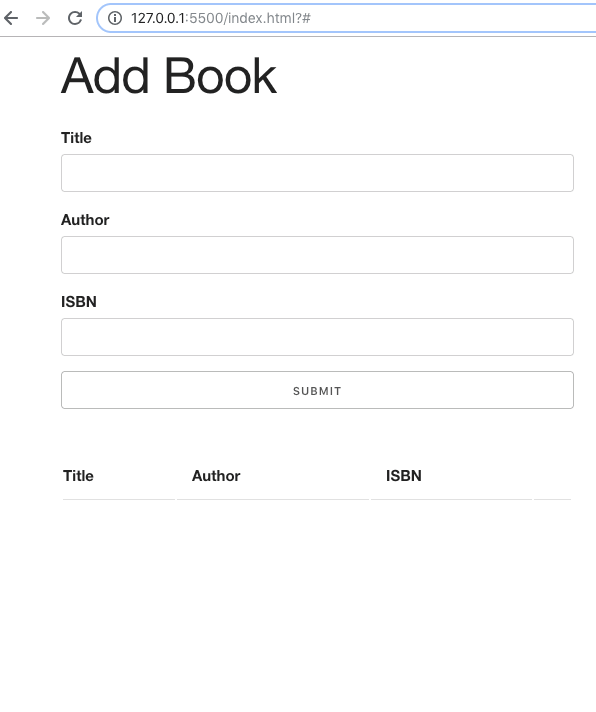
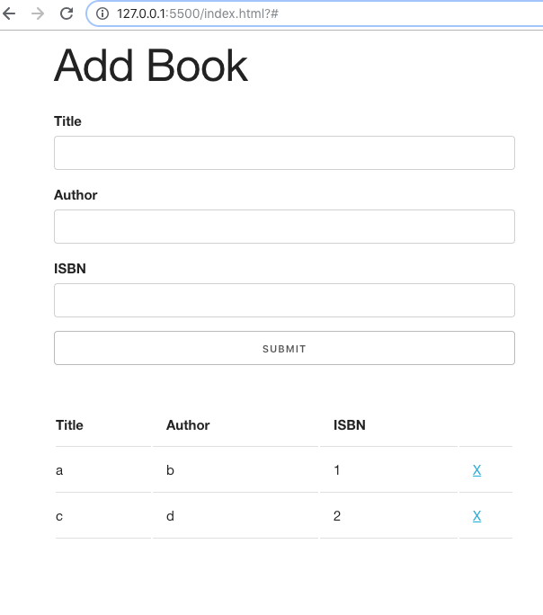

# Booklist website

A website where you can add books to a book list. The added book list persist with Local Storage.

The website was first built with ES5 syntax and then converted to ES6 syntax using classes. The ES5 script is left but its content is commented out.

There is validation and a message so that all fields are filled in before the book is being saved.

Skeleton is used for styling.

## A screenshot

On desktop, add books

On desktop, validation and delete

## Author
* Albert Stjärne (https://github.com/AlbertStjarne)